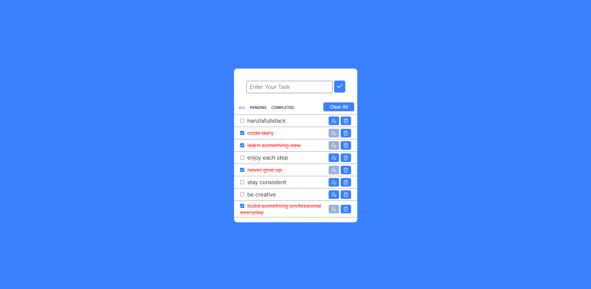

# ✅ Todo App

A responsive todo application with task management, filtering, and localStorage persistence. Add, edit, delete, and filter your tasks with a clean, mobile-friendly interface.

[Deployed App](https://hanzlafullstack-todo-app.vercel.app/) • [GitHub Repo](https://github.com/hanzlafullstack/Todo-app)



## Overview

I built this to practice DOM manipulation, array operations, and localStorage integration. The focus is on managing state, handling user input, and creating a smooth, intuitive task management experience.

## Tech Stack

- HTML5 for structure
- CSS3 for layout and responsive design
- JavaScript (ES6+) for app logic and DOM updates
- localStorage API for data persistence

## Features

- Add new tasks with input validation
- Edit existing tasks inline
- Delete individual tasks
- Filter tasks by status (All, Pending, Completed)
- Clear all tasks with confirmation
- Mark tasks as completed or pending
- Data persistence using localStorage
- Responsive design for mobile and desktop

## Folder Structure

```
Todo-app/
│
├── index.html
├── style.css
├── index.js
└── preview/
    └── image.png
```

## What Went Well

- Clean separation between data storage (localStorage) and UI rendering
- Simple filter system that works well for task status management
- Intuitive user interactions with clear edit and delete buttons
- Data persistence means tasks survive page reloads

## What I'd Improve Next

- Add task priority levels or due dates for better organization
- Implement drag and drop to reorder tasks
- Add task categories or tags for better organization
- Include undo/redo functionality for better user experience
- Add keyboard shortcuts for faster task management
- Show task completion statistics or progress tracking

## What I Learned

- Managing arrays of objects in JavaScript
- Using localStorage for client-side data persistence
- Filtering and manipulating DOM elements dynamically
- Creating reusable functions for CRUD operations
- Handling form inputs and user interactions
- Building state management without frameworks

## Setup

1. Clone the repository:
   ```bash
   git clone https://github.com/hanzlafullstack/Todo-app.git
   cd Todo-app
   ```
2. Run locally:
   - Open `index.html` directly in your browser, or start a simple server:
     ```bash
     npx serve .
     # or
     python -m http.server 5173
     ```
3. Use the todo app:
   - Enter a task in the input field and click the add button
   - Click the edit icon to modify a task
   - Click the delete icon to remove a task
   - Use filter buttons to show All, Pending, or Completed tasks
   - Click "Clear All" to remove all tasks

## Notes

- All tasks are stored in browser localStorage, so they persist across sessions
- Tasks are stored as an array of objects with properties like id, text, and status
- Designed as a learning project to understand state management and data persistence

## License

For learning and portfolio use. Feel free to use this as a starting point for your own todo applications.

References:  
- Deployed app: <a href = "https://hanzlafullstack-todo-app.vercel.app/ ">https://hanzlafullstack-todo-app.vercel.app/ </a>
- Repository: <a href = "https://github.com/hanzlafullstack/Todo-app">https://github.com/hanzlafullstack/Todo-app</a>

